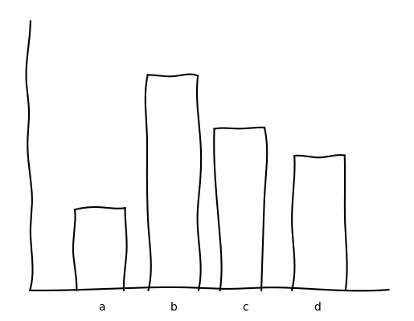

# badgraph
Bar graph generator. Beautiful data visualization.

I figured out that matplotlib xkcd does pretty much the same thing.

Sample output:

Todo:

Add axis labels. Add support for pictures as labels. Add title. Add smarter 
text management (text wrap, etc).

Better font.

Color in bars.

Bar y pos should match with x-axis y coord closest to the bar's endpoints.

To make both endpoints precise, make the error not accumulate.
